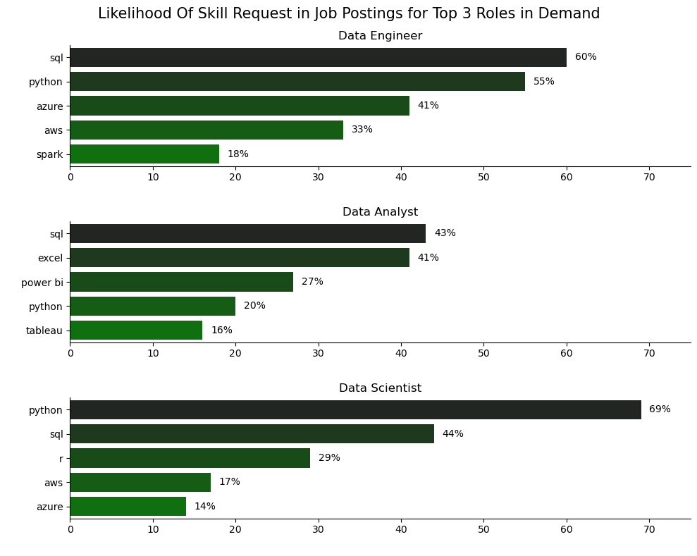
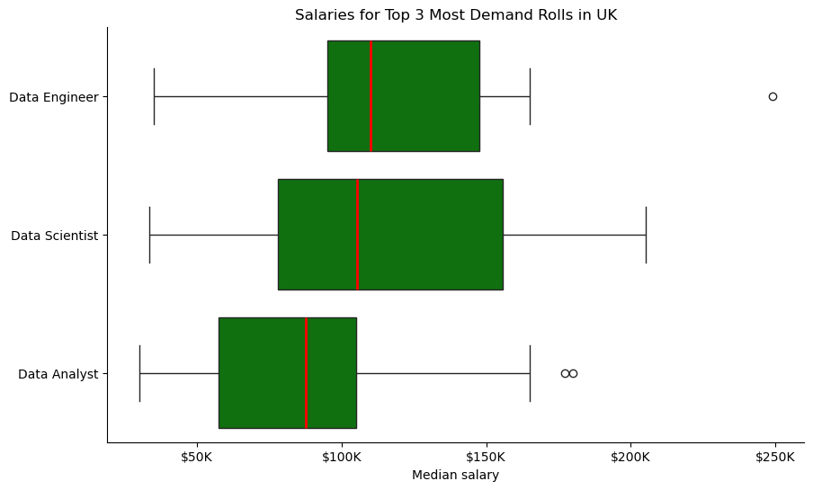
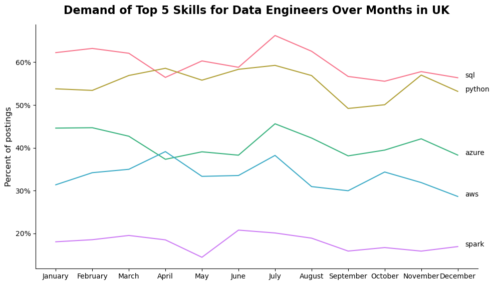
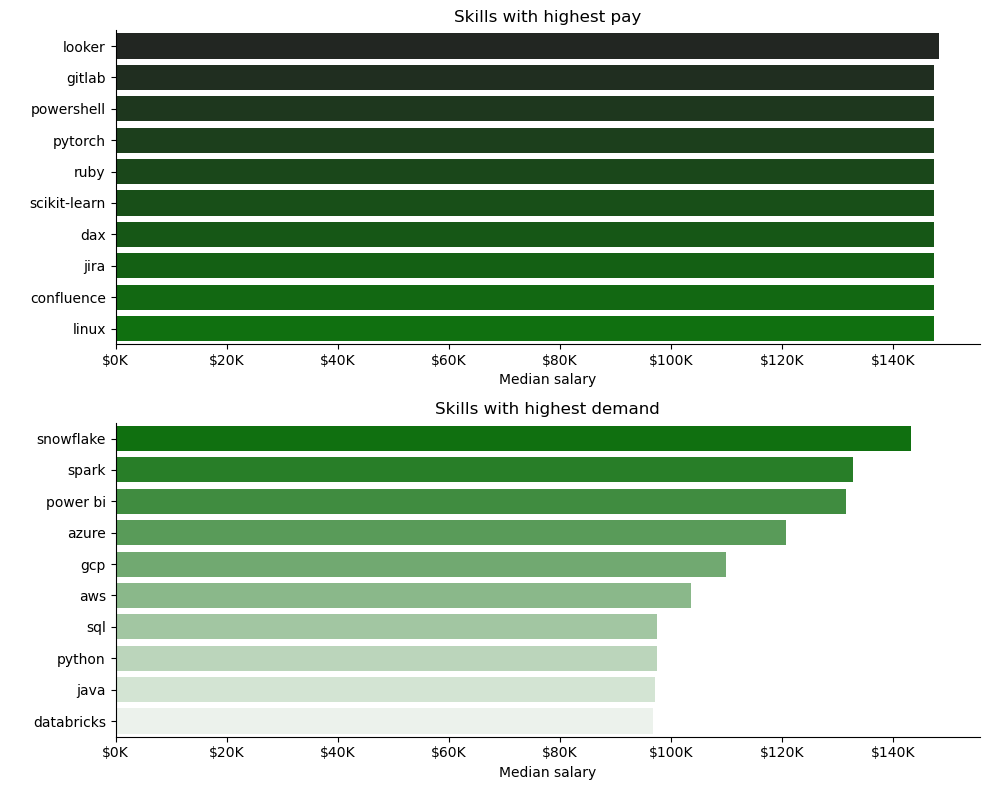
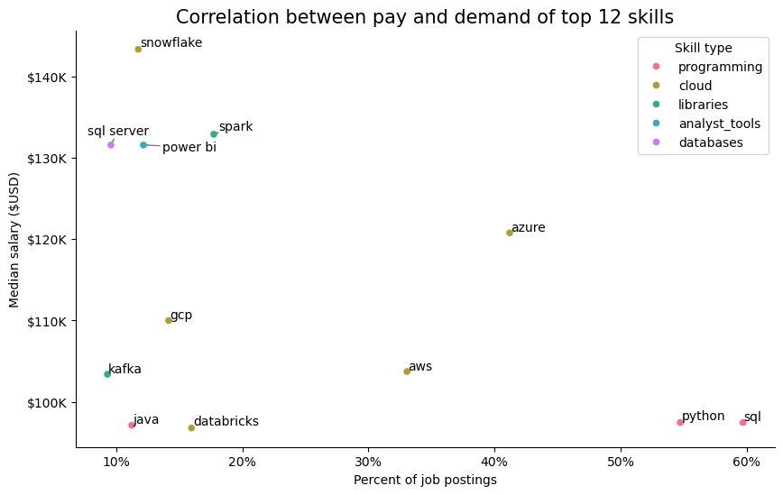

# Overview

This project analyzes the United Kingdom data job market, with a focus on data engineering roles. The goal is to uncover valuable insights about skills, salaries, and demand in this field.

The dataset comes from [Luke Barousse's Python Course](https://lukebarousse.com/python), providing a solid foundation for analysis. It includes detailed information on job titles, salaries, locations, and key skills.

## Questions to Answer

1. What are the most in-demand skills for the top three most popular data roles?
2. What are the salary distributions for the top three most popular data roles?
3. How does skill demand trend throughout the year for Data Engineers?
4. How well do Data Engineering jobs and skills pay?
5. What are the optimal skills for Data Engineers to learn (high demand AND high pay)?

## Tools Used

- **Python** – the backbone of the analysis, enabling data processing and insight extraction.
    - **Pandas** – for data manipulation and analysis.
    - **Matplotlib** – for basic visualizations.
    - **Seaborn** – for advanced and visually appealing charts.
- **Jupyter Notebooks** – for running Python scripts with notes and inline results.
- **Visual Studio Code** – for developing and executing Python scripts.
- **Git & GitHub** – for version control and sharing code.

# Analysis

Each Jupyter Notebook in this project explores specific aspects of the UK data job market. You can review their contents and code in the [project folder](python_files).

## Skill Demand

*Bar chart showing the top 5 most requested skills for the three most popular data roles in the UK job market.*

### Insights

SQL stands out as a foundational skill across the data job market, leading in two of the three most popular roles and exceeding 40% demand in each.

Python dominates Data Scientist roles, appearing in nearly 70% of postings. In Data Engineering roles, demand remains strong at around 55%, while for Data Analysts it ranks fourth at approximately 20%.

Cloud platforms such as Azure and AWS are strongly associated with Data Engineering roles and also appear in Data Scientist postings, though less frequently.

Overall, the skill distribution shows a clear separation between analytical, scientific, and engineering tracks, with some shared foundational tools but distinct specialization requirements.

## Salary Distribution by Role

*Box plot illustrating the salary distribution for the top three data roles.*

### Insights

Data Engineers have the highest median salary among the three roles.

All three roles share a similar lower salary range, but Data Scientists demonstrate the highest upper salary range, reflecting greater earning potential at senior or specialized levels.

While starting salaries are relatively aligned, long-term earning potential is strongest in Data Science and Data Engineering tracks.

# Skills Trend and Pay Analysis for Data Engineers

## Skill Trends for Data Engineers (2023)

*Line graph illustrating monthly demand trends for top Data Engineer skills in the UK.*

### Insights

SQL and Python consistently lead in demand throughout the year.

Azure and AWS follow, fluctuating between roughly 30% and 45%.

Spark shows the lowest overall demand, averaging around 20%.

Overall, trends indicate a stable demand structure, with core programming and querying skills leading, supported by cloud and distributed processing technologies.

## Skill Pay

*Two bar charts comparing the highest-paying skills and the most in-demand skills for Data Engineers in the UK.*

### Insights

Specialized tools like Looker and DAX command higher median salaries than more universal languages like Python or SQL, likely due to a lower supply of experts.

Big Data and cloud warehousing tools—Snowflake, Spark, and Databricks—occupy the "sweet spot," combining high demand with strong pay.

Jira, Confluence, and GitLab rank highly in pay charts, reflecting the value of project management, workflow automation, and DevOps expertise.

Among cloud providers, Azure leads in median salary, followed by GCP and AWS, indicating a premium for enterprise-focused cloud skills.

## Optimal Skills to Learn

*Scatter plot highlighting the most optimal skills (high demand & high pay) for Data Engineers in the UK.*

### Insights

Foundational skills like SQL and Python are widely demanded but sit lower on the salary scale due to a large candidate pool.

Azure combines strong demand over 40% with high median pay, making it a top-tier skill.

Snowflake and Spark command the highest salaries despite appearing in fewer than 20% of postings, demonstrating a specialization premium.

Power BI shows a strong correlation between analytical utility and pay, exceeding general programming skills.

Salary gaps exist among cloud providers, with Azure and GCP currently offering higher median compensation than AWS.

# Conclusions

From the analysis of the UK data job market:

- SQL and Python remain foundational skills with consistently high demand.  
- Data Engineers have the highest median salaries, while Data Scientists offer the greatest potential at the top end.  
- Cloud platforms (Azure, GCP, AWS) and Big Data technologies (Spark, Snowflake, Databricks) represent high-value skills, combining demand with premium pay.  
- Specialized tools like Looker, DAX, and Power BI offer niche opportunities with higher-than-average compensation.

## Personal Reflections

Throughout this project, I improved essential skills such as data cleaning, data visualization, and the basics of Python. I faced several challenges along the way, including handling messy data and selecting the right visualizations, but in the end, I successfully completed the project and gained valuable practical experience.